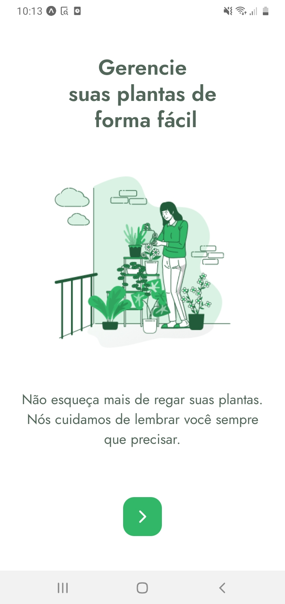
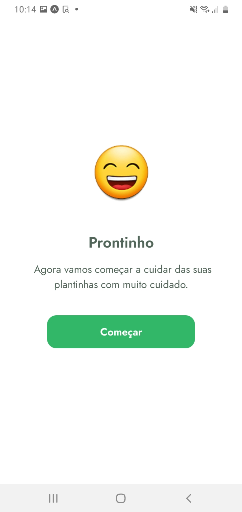
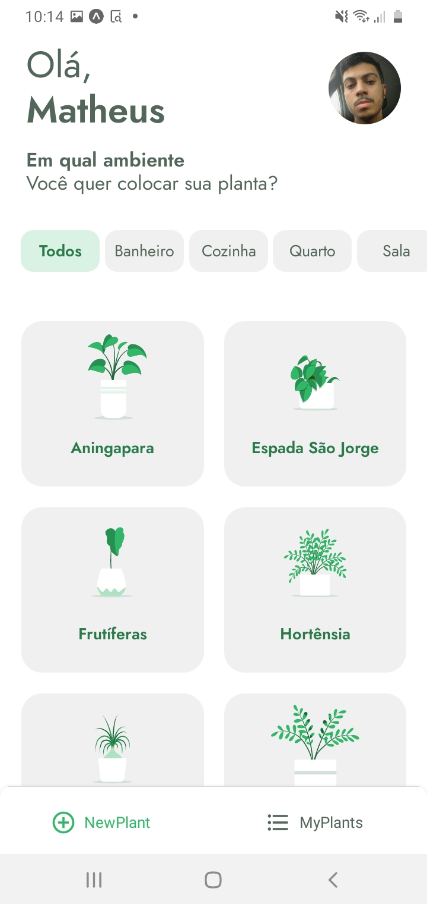
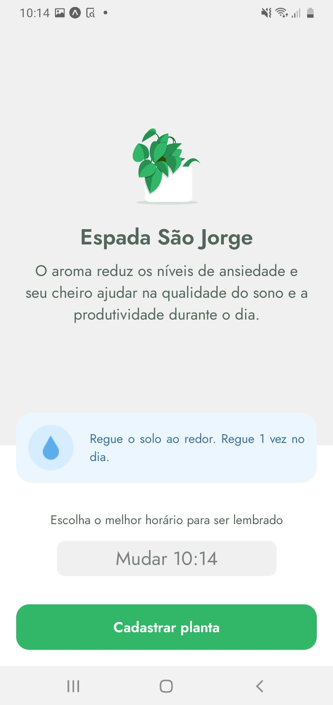

## Plant Manager
---
App que te auxilia a cuidar das suas plantas, dando informações e o mais importante, te alertando quando você precisa regar.

## #NLW - 05 🚀
Este projeto faz parte de mais uma semana em rumo do proximo nível, desenvolvida pela Rocketseat. Ministrado com maestria pelo professor [Rodrigo](https://github.com/rodrigorgtic).

## 📷Veja:

  
  
  
  
  
  

 
 

## 💻Tecnologias
✔️ React Native  
✔️ Expo  
✔️ TypeScript  
✔️ React Hooks  
✔️ Styled-components  
✔️ JSON Server  

 

## ⚙️Configuração
1- Para instalar as dependências:
> yarn install

2- Para iniciar a aplicação:
> yarn start
